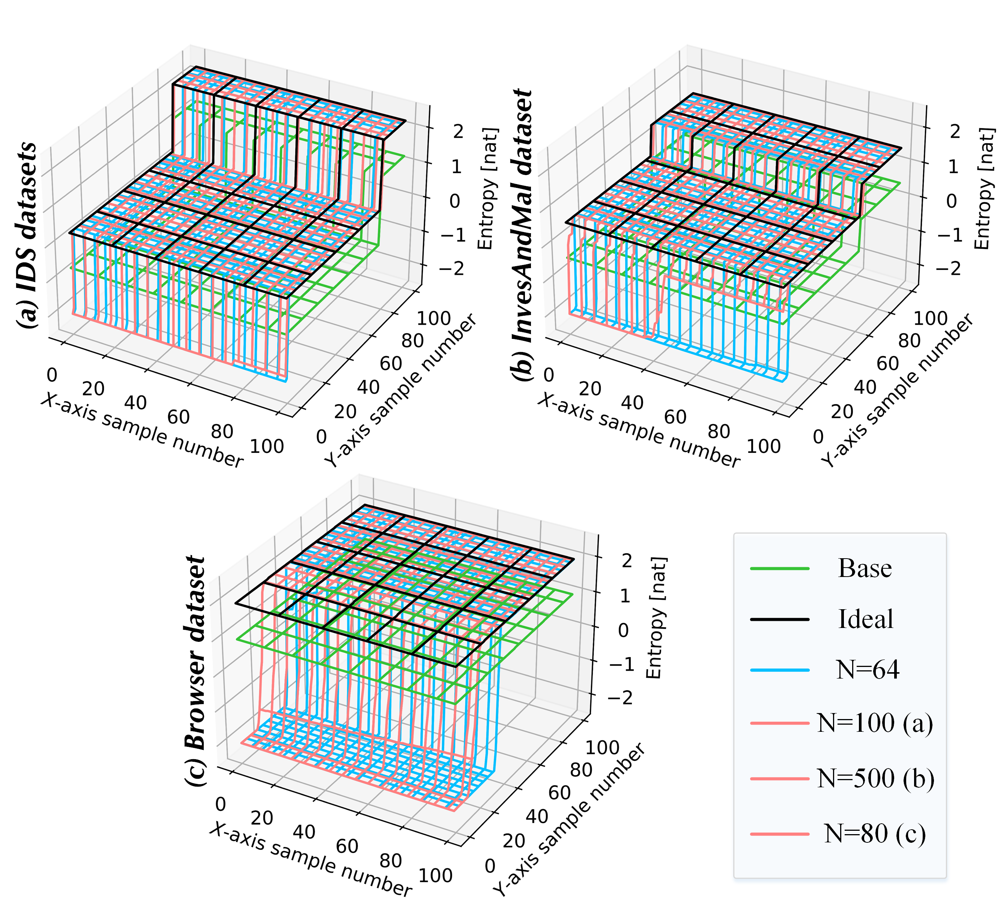
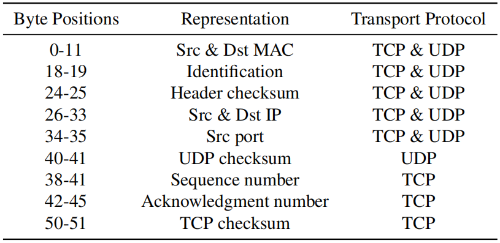

# Rebuttal -- Towards Context-Aware Traffic Classification via Time-Wavelet Fusion Network

## Usable Information of Packet Byte

We deliver a theoretical analysis of usable information theory [ICMLPVI, ICLRVI] to explain and analyze the information of packet bytes. 

## Anonymization

We anonymize the header byte, such as IP, MAC, checksums, and the sequence number. We show the specific anonymous fields in the figure below. 

## Comparison with more baselines in more datasets

According to the reviewers' suggestions, we added more baselines [ToN_PEAN, AAAI_YaTC, KDD_MT-FlowFormer] and more datasets [USTC-TFC, CrossPlatform, CIRA-CIC-DoHBrw, QUIC]. 

These baselines involve multi-modal (multi-representational) models based on attention mechanisms and transformer architectures, and the expanded datasets include more scenarios: USTC-TFC malware, cross-platform, DoH, QUIC. 

For PEAN, it considers raw bytes and length sequence, and uses the attention mechanism. However, it only considers intra-flow features and cannot capture contextual information to enhance the analysis of the flow. Another similar one is YaTC. 

TrafficScope achieves an accuracy and F1 score that is 3%-6% higher than YaTC. 
For MT-FlowFormer, since it only randomly selects an additional flow to enhance the representation, the detection results are heavily dependent on the selected flow, and are not stable enough in the face of dynamic background traffic.

| Dataset       | IDS   |       | CrossNet |       | VPN   |       | AndMal |       | USTC  |       | CrossPlatform |       | CIC-DoHBrw |       | QUIC  |       |
|:---------------:|-------:|-------:|----------:|-------:|-------:|-------:|--------:|-------:|-------:|-------:|---------------:|-------:|------------:|-------:|-------:|-------:|
| Methods       | AC    | F1    | AC       | F1    | AC    | F1    | AC     | F1    | AC    | F1    | AC            | F1    | AC         | F1    | AC    | F1    |
| FlowPrint     | 86.99 | 87.02 | 82.38    | 87.11 | 79.62 | 78.2  | 72.38  | 72.89 | 83.63 | 87.23 | 89.49         | 89.97 | 88.47      | 89.03 | 87.36 | 88.44 |
| FS-Net        | 72.05 | 71.31 | 84.36    | 82.22 | 76.47 | 77.37 | 81.37  | 82.38 | 85.24 | 83.72 | 75.36         | 72.26 | 74.28      | 72.91 | 73.54 | 71.85 |
| Whisper       | 79.34 | 82.43 | 71.24    | 71.39 | 80.34 | 79.66 | 62.45  | 63.56 | 76.74 | 78.69 | 82.17         | 83.92 | 81.26      | 82.18 | 80.54 | 81.27 |
| ET-BERT       | 90.28 | 91.02 | 91.31    | 92.43 | 91.29 | 85.98 | 88.56  | 89.65 | 92.12 | 93.25 | 92.14         | 92.32 | 91.72      | 91.97 | 90.87 | 91.14 |
| FlowLens      | 91.25 | 87.89 | 83.85    | 83.48 | 86.1  | 86.68 | 84.22  | 84.89 | 87.3  | 89.71 | 93.51         | 88.53 | 93.07      | 88.15 | 92.26 | 86.93 |
| HyperVision   | 93.28 | 86.26 | 86.28    | 87.47 | 71.82 | 71.97 | 85.82  | 84.29 | 89.02 | 90.21 | 94.79         | 91.95 | 94.52      | 88.34 | 93.97 | 87.05 |
| nPrint        | 95.68 | 90.4  | 88.72    | 89.19 | 85.34 | 84.2  | 87.42  | 88.23 | 91.4  | 92.65 | 95.96         | 93.07 | 95.83      | 91.92 | 95.14 | 90.61 |
| PEAN          | 92.13 | 84.31 | 92.49    | 87.93 | 90.59 | 86.28 | 88.26  | 89.46 | 93.02 | 86.12 | 93.74         | 85.47 | 93.23      | 85.14 | 92.82 | 83.93 |
| YaTC          | 93.95 | 92.17 | 94.2     | 91.16 | 92.63 | 90.84 | 89.91  | 90.29 | 93.22 | 91.64 | 95.02         | 93.14 | 94.57      | 92.43 | 93.84 | 91.34 |
| MT-FlowFormer | 90.11 | 90.97 | 90.22    | 89.14 | 89.97 | 84.41 | 86.92  | 87.22 | 91.54 | 92.35 | 91.97         | 92.54 | 91.52      | 91.97 | 90.59 | 90.96 |
| TrafficScope  | 98.65 | 92.46 | 98.42    | 94.3  | 97.29 | 97.33 | 95.39  | 95.17 | 98.6  | 94.43 | 98.97         | 95.15 | 98.85      | 95.09 | 98.77 | 94.84 |

These results echo back the feature representation described above in above, and also demonstrate our original intention for TrafficScope of designing to model and fuse context information. 

## Demonstrating the advantages of Wavelet Transform

To demonstrate the effectiveness of wavelet transformation, we further supplemented the ablation experiment for wavelet transformation based on the results of Figure 8 (a) in the manuscript, denoted as TrafficScope/w, which refers to considering the context but not performing wavelet transformation for the context.

The F1 scores of the four datasets are shown in the following table. We can see that the results of TrafficScope/w and TrafficScope/c are not much different, and sometimes even lower than TrafficScope/c. This shows that if the context information is directly integrated (without wavelet transformation), the model cannot effectively utilize this contextual information, that is, it cannot bring substantial performance improvement.

| F1-Score    | TrafficScope | TrafficScope/t | TrafficScope/c | TrafficScope/w |
|:-------------:|--------------:|----------------:|----------------:|----------------:|
| IDS         | 92.5         | 84.6           | 90             | 89.9          |
| CrossNet    | 94.3         | 83.2           | 89.9           | 90.1          |
| ISCXVPN     | 97.3         | 79.1           | 90.1           | 90.8          |
| InvesAndMal | 95.2         | 81.2           | 88.4           | 89.2          |

We also performed the dynamic content evaluation experiment in Table 2 of the manuscript (mixing different contexts) and supplemented the results after ablating the wavelet transform. As shown in the following table, as more and more other types of data are mixed into the context, not performing the wavelet transform will lead to a significant decrease in the results. Compared with the complete TrafficScope, this also illustrates the effectiveness of our proposed wavelet transform for modeling non-stationary contexts. 

| With Wavelet Transform    | $\kappa$=0   | $\kappa$=1   | $\kappa$=2   | $\kappa$=3   | $\kappa$=4   | $\kappa$=5   |
|:---------------------------:|-------:|-------:|-------:|-------:|-------:|-------:|
| Acc                       | 98.7  | 98.2  | 97.8  | 96.4  | 95.9  | 94.9  |
| F1                        | 92.5  | 92.2  | 91.6  | 91.1  | 90.3  | 89.3  |

| Without Wavelet Transform | $\kappa$=0   | $\kappa$=1   | $\kappa$=2   | $\kappa$=3   | $\kappa$=4   | $\kappa$=5   |
|:---------------------------:|-------:|-------:|-------:|-------:|-------:|-------:|
| Acc                       | 91.4  | 90.3  | 88.8  | 87.6  | 86.2  | 85.1  |
| F1                        | 89.9  | 88.5  | 87.3  | 86.8  | 85.2  | 83.8  |

### References
*[TDSC_DFNet] Zhao Z, et al. Effective DDoS Mitigation via ML-Driven In-network Traffic Shaping[J]. IEEE TDSC, 2024.*

*[INFOCOM_RIDS] Zhao Z, et al. RIDS: Towards Advanced IDS via RNN Model and Programmable Switches Co-Designed Approaches[C]. INFOCOM, 2024.*

*[INFOCOM_Mousika] Xie G, et al. Mousika: Enable general in-network intelligence in programmable switches by knowledge distillation[C]. INFOCOM, 2022.*

*[USENIX_Rosetta] Xie R, et al. Rosetta: Enabling robust tls encrypted traffic classification in diverse network environments with tcp-aware traffic augmentation[C]. USENIX Security, 2023.*

*[CCS_nPrint] Holland J, et al. New directions in automated traffic analysis[C]. CCS, 2021.*

*[WWW_TFE-GNN] Zhang H, et al. TFE-GNN: A Temporal Fusion Encoder Using Graph Neural Networks for Fine-grained Encrypted Traffic Classification[C]. WWW, 2023.*

*[WWW_AppSniffer] Oh S, et al. AppSniffer: Towards Robust Mobile App Fingerprinting Against VPN[C]. WWW, 2023.*

*[KDD_PacRep] Meng X, et al. Packet representation learning for traffic classification[C]. KDD, 2022.*

*[ICMLPVI] Kawin Ethayarajh, et al. Understanding Dataset Difficulty with V-Usable Information[C]. ICML, 2018.*

*[ICLRVI] Yilun Xu, et al. A Theory of Usable Information under Computational Constraints[C]. ICLR, 2020.*

*[NDSS_FlowPrint] Thijs Van Ede, et al. FlowPrint: Semi-supervised mobile-app fingerprinting on encrypted network traffic[C]. NDSS, 2020.*

*[ToN_PEAN] Peng Lin, et al. A novel multimodal deep learning framework for encrypted traffic classification[J]. ToN, 2022.*

*[AAAI_YaTC] Ruijie Zhao, et al. Yet another traffic classifier: A masked autoencoder based traffic transformer with multi-level flow representation[C]. AAAI, 2023.*

*[KDD_MT-FlowFormer] Ruijie Zhao, et al. MT-FlowFormer: A semi-supervised flow transformer for encrypted traffic classification[C]. KDD, 2022.*

*[USTC-TFC] Wei Wang, et al. Malware traffic classification using convolutional neural network for representation learning[C]. ICOIN, 2017.*

*[CrossPlatform] https://recon.meddle.mobi/cross-market.html*

*[CIRA-CIC-DoHBrw] https://www.unb.ca/cic/datasets/dohbrw-2020.html*

*[QUIC] https://www.kaggle.com/datasets/adam357/quic-network-capture-data*

*[KDD17_Anderson] Blake Anderson, et al. Machine learning for encrypted malware traffic classification: accounting for noisy labels and non-stationarity[C], KDD, 2017.*

*[Wavelet_Rhif] Rhif M, et al. Wavelet transform application for/in non-stationary time-series analysis: A review[J]. Applied Sciences, 2019.*

*[Non-stationary_Rincón] Rincón D, Sallent S. On-line segmentation of non-stationary fractal network traffic with wavelet transforms and Log-likelihood-based statistics[C]//International Workshop on Quality of Service in Multiservice IP Networks. Berlin, Heidelberg: Springer Berlin Heidelberg, 2004.*

*[Real_Salagean] Salagean M. Real network traffic anomaly detection based on analytical discrete wavelet transform[C]//2010 12th International Conference on Optimization of Electrical and Electronic Equipment. IEEE, 2010.*
